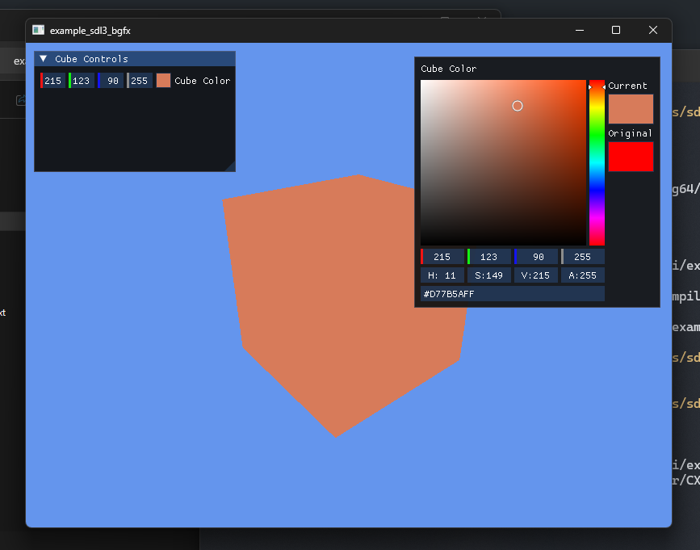

# SDL3 & BGFX with ImGui Examples

This project demonstrates using **SDL3**, **BGFX**, and **Dear ImGui** together.

### Libraries

- **SDL3**: [https://github.com/libsdl-org/SDL](https://github.com/libsdl-org/SDL)  
- **BGFX**: [https://github.com/bkaradzic/bgfx.cmake](https://github.com/bkaradzic/bgfx.cmake)  
- **ImGui**: [https://github.com/fernaerell/imgui](https://github.com/fernaerell/imgui)  

The ImGui library has been modified to support:

- Static builds with CMake  
- BGFX backend integration, based on: [sdl-bgfx-imgui-starter](https://github.com/pr0g/sdl-bgfx-imgui-starter) and [BGFX repo](https://github.com/bkaradzic/bgfx)  

All libraries are built manually, and `find_package` is used to link them to this project.

### Notes

- Static ImGui with BGFX is stable (not sure).  
- Shared ImGui with BGFX backend may cause segmentation faults (likely from BGFX backend code).  

### Build Instructions (Windows)

1. Compile shaders (Windows only) using:  
   `scripts/compile_shaders_win.sh`  

2. Build and run the project using one of the following scripts:  
   - `scripts/build.sh`  
   - `scripts/run.sh`  
   - `scripts/build_and_run.sh`
